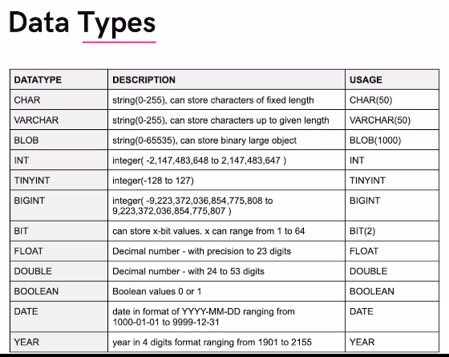

## Table Queries

### Create / Delete Table

1. `CREATE TABLE table_name`  
Creates a new table in the selected database.

1. `CREATE TABLE IF NOT EXISTS table_name`  
Creates a table only if it does not already exist.

1. `DROP TABLE table_name `  
Deletes a table permanently along with all its data.

1. `DROP TABLE IF EXISTS table_name ` 
Deletes a table only if it exists (avoids error).

1. `TRUNCATE`  
Removes all rows from a table but keeps its structure.

### Insert Data

1. `INSERT INTO`  
Adds new data into a table. 

1. `INSERT INTO ... VALUES`  
Inserts specific values as new rows in a table.

1. `INSERT INTO ... SELECT`  
Inserts data into a table from another table.

### Read / Fetch Data

1. `SELECT`  
Retrieves data from a table.

1. `SELECT * FROM table_name `  
Fetches all columns from a table.

1. `SELECT column1, column2`  
Fetches only selected columns.

1. `SELECT DISTINCT`  
Retrieves unique (non-duplicate) values.

1. `WHERE`  
Filters records based on a condition.

1. `ORDER BY`  
Sorts records in ascending or descending order.

1. `LIMIT ` 
Restricts the number of rows returned.

### Update / Delete Data

1. `UPDATE`  
Modifies existing data in a table.

1. `DELETE`  
Removes rows from a table.

1. `DELETE FROM table_name WHERE condition ` 
Deletes specific rows based on a condition.

### Modify Table Structure

1. `ALTER TABLE ADD `  
Adds a new column to a table.

1. `ALTER TABLE DROP `  
Removes a column from a table.

1. `ALTER TABLE MODIFY`   
Changes a column’s data type or size.

1. `ALTER TABLE RENAME`   
Renames a column or table (version-dependent).

1. `RENAME TABLE`   
Changes the name of an existing table.

### Show / Describe Table

1. `SHOW TABLES`   
Displays all tables in the current database.

1. `DESCRIBE table_name`   
Shows table structure and column details.

1. `DESC table_name `  
Short form of DESCRIBE.

1. `SHOW CREATE TABLE`   
Displays the SQL used to create a table.

--- 

## Sigma Prime Note:

## Create Table (schema/columns)
```code
CREATE TABLE table_name (
    column_name1 datatype constraint,
    column_name2 datatype constraint,
);
```

### Data Type



### MySql Code Snippet:

```sql
CREATE DATABASE IF NOT EXISTS instagram;

USE instagram;

CREATE TABLE user (
 id INT,
 name VARCHAR(30),
 email VARCHAR(50),
 followers INT,
 following INT
);

```

