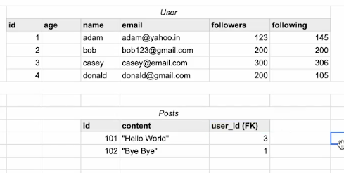

## Sigma Prime Note

### Constraints

1. `PRIMARY KEY`  
makes a column unique & not null but used only for one

```sql
CREATE TABLE temp (
    id int not null,
    PRIMARY KEY (id)
);
```

2. `FOREIGN KEY`  
prevent actions that would destroy links between tables

```sql
CREATE TABLE temp (
    cust_id int, 
    FOREIGN KEY (cust_id) references customer(id)               -- here 'customer' is table_name, (id) is column of it
)
```

---

### Tables



### MySql Code Snippet

```sql
CREATE DATABASE college;

CREATE DATABASE IF NOT EXISTS instagram;

USE instagram;

CREATE TABLE user (
 id INT,									-- id INT PRIMARY KEY   .. 	we can also add primary key like this
 age INT,
 name VARCHAR(30) NOT NULL,
 email VARCHAR(50) UNIQUE,
 followers INT DEFAULT 0,
 following INT,
 
 CONSTRAINT age_check CHECK (age >= 13),
 PRIMARY KEY (id)
);

CREATE TABLE post (
 id INT PRIMARY KEY,
 content VARCHAR(100),
 user_id INT,
 
 FOREIGN KEY (user_id) REFERENCES user(id)
);
```
---

### How to open ER Diagram

If tables already exist (Reverse Engineering)

- Open MySQL Workbench
- Connect to your MySQL server
- Click Database (top menu)
- Click Reverse Engineer
- Select your connection → Next
- Choose your database (schema) → Next → Next
- Finish

✅ ER Diagram will open automatically.